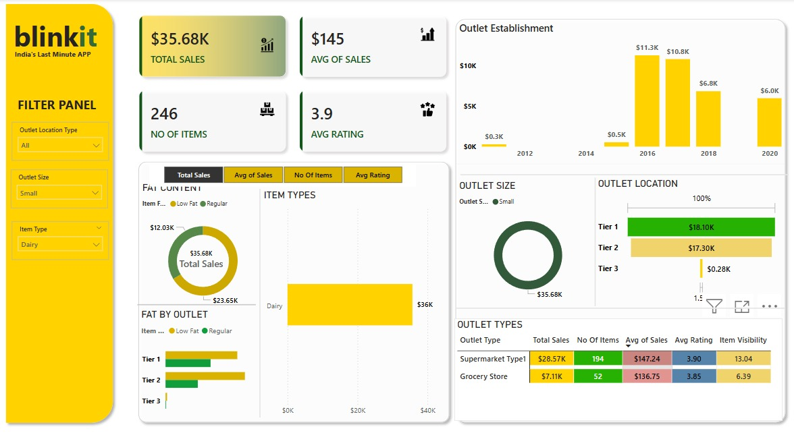

# BlinkIT Grocery Sales Analysis

This project is a Power BI dashboard built to analyze the sales performance of BlinkIT, a grocery delivery platform. The analysis focuses on sales revenue, product performance, outlet types, and customer ratings to uncover business insights that can help improve decision-making.

---

## 📌 Project Objectives

- Analyze overall sales and average sales per transaction
- Understand the performance of different item types
- Evaluate the effect of fat content on total sales
- Assess customer satisfaction using average ratings
- Visualize sales trends across outlet sizes, locations, and types

---

## 🧮 KPIs Used

- **Total Sales**: Total revenue generated from all items sold  
- **Average Sales**: Average revenue per sale  
- **Number of Items Sold**: Total quantity of items sold  
- **Average Rating**: Mean customer rating for sold items

---

## 📊 Charts & Visuals

| Chart Title | Objective | Chart Type |
|-------------|-----------|------------|
| Total Sales by Fat Content | Analyze fat content impact | Donut Chart |
| Sales by Item Type | Compare performance by category | Bar Chart |
| Fat Content by Outlet | Segment sales by outlet & fat | Stacked Column Chart |
| Sales by Outlet Establishment | Compare performance by outlet age/type | Line Chart |
| Sales by Outlet Size | Correlation of size & sales | Donut / Pie Chart |
| Sales by Outlet Location | Regional performance analysis | Funnel Map |
| All Metrics by Outlet Type | Full metric breakdown by outlet | Matrix Card |

---

## 📌 Key Insights

- High-fat items showed significant contribution to total sales
- Fresh food & dairy products were the best performers
- Small-sized outlets had better average sales than expected
- Newer outlets received higher customer ratings
- Sales distribution varied significantly across locations

---

## 🧰 Tools & Technologies

- Power BI (Dashboard creation)
- Power Query (Data cleaning & transformation)
- DAX (KPIs and custom measures)
- Excel (Data source)

---

## 📁 Files in this Repository

- `blinkit_project.pbix` – Power BI dashboard file
- `BlinkIT Grocery Data.xlsx` – Raw dataset
- `blinkit.jpg` – Final dashboard image

---

## 🧑‍💻 Author

**Neha Yadav**  
Data Analyst Enthusiast  
📧 Dev.nehayadav123@gmail.com  
🌐 [LinkedIn Profile](https://www.linkedin.com/in/neha-yadav-428092228)

---

## 📸 Dashboard Preview

---

